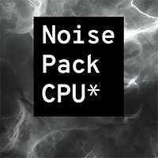
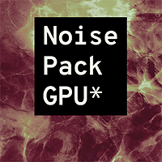

Noise CPU & GPU for GML
==========

[](https://marketplace.yoyogames.com/assets/5733/noisepack-gpu)

Noise algorithms studied &amp; ported to GML. Contains CPU and GPU noise calculation scripts.

Calculating noise on the GPU is faster than doing it on CPU couple of thousand times. This is the best method if the noise
is going to be used as an image (for image processing or compositing images).

If the calculated noise needs to be turned into an array of numerical data, the process gets slower. The bottleneck is 
not calculating the noise, but getting the data from the image.

Since calculating noise on the GPU is extremely fast, this extension lets you calculate big sample data at once,
and cache it. This is a design choice to make the process more efficient.

This initial calculation is done by the "create" script.

```
    Some benchmark results are presented below for the
    create script to give you an idea:

    *   256x256 gpu perlin noise calc. -> ~  1.7 ms (milliseconds)
    * 1024x1024 gpu perlin noise calc. -> ~ 13.5 ms
    * 2048x2048 gpu perlin noise calc. -> ~ 43.0 ms
    
    (Numbers may change for you depending on your CPU and GPU)
```

The extension caches the calculated noise in a buffer so the data lookup is as fast as looking up data from an array.

This look up actions can be done using the "gpu_noise" scripts. gpu_noise_*d scripts are fast and can be run
several times on a single step event without reducing the performance of the application/game.


```
    Here are some benchmark results for looking up
    calculated noise data:
    
    Cached data lookup    -> ~ 0.005 ms per lookup
    Un-cached data lookup -> ~ 1.5 ms per lookup 
    
    (Numbers may change for you depending on your CPU)
```

Spliting the process into "create" and "lookup" gives developers a flexibility. Several noise maps can be created (for such as landmass, atmosphere, vegitation etc.) on a loading screen and look data up realtime with inexpensive scripts.


Usage
-----

```gml
    // CREATE EVENT
    // create a noise using GPU
    landmass = gpu_noise_create(noisetype, seed, width, height);

    // or 
    // use create_ext script if you need more options
    landmass = gpu_noise_create(noisetype, seed, width, height, persistence, frequency, scale);

    // STEP or DRAW EVENT
    var value = gpu_noise_3d(landmass, x, y, z);

    // That's it. REMEMBER to delete the data from the memory using:
    gpu_noise_free(landmass);
```

Extras
------

```gml
    // if you need to create different chunks of noise, use offset script
    landmass = gpu_noise_offset(width, [height, z]);

    // if you get the GPU calculated noise as a surface,
    var surface = gpu_noise_to_surface(landmass);

    // REMEMBER to delete the data from the memory using:
    // This will delete the surface and the buffer.
    gpu_noise_free(landmass);
```

Extension Files
------

The package contains files related to the demonstration application. You don't need every file for the extension to function. Required files are GPU_Toolkit>GPU Noise scripts and the Shaders you will use.


Contributing
------
It's through your contributions that cbDataGUI will continue to improve. You can contribute in several ways.

**Issues:** Provide a detailed report of any bugs you encounter and open an issue.

**Documentation:** If you'd like to fix a typo or beef up the docs, you can fork the project, make your changes, and submit a pull request.

**Code:** Make a fix and submit it as a pull request. When making changes, add comments to describe the changes.


Author
------

Cem Baspinar

+ http://github.com/aft
+ http://twitter.com/aft


Thanks
------
Thanks to anyone who downloaded the extention from the marketplace.


Copyright and License
------

Copyright 2017 Cem Baspinar
Code released under the MIT License.
